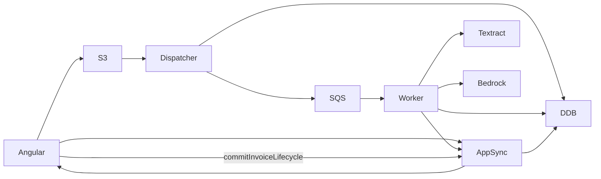

# Invoice Onboarding — Arquitectura End-to-End

> Documento canónico del flujo de alta de facturas (EkoLedger SMS).  
> Última actualización: alineado con lifecycle v2 (25 estados).

## 1. Visión general

El wizard de alta de facturas combina:

- **WIP local** (Angular `sessionStorage`) para datos editados por el usuario entre steps.
- **WIP en DynamoDB** (`isWip=true`, TTL 24h) para ancla de pipeline (META + EXTRACTION).
- **Persistencia definitiva** solo en `commitInvoiceLifecycle` (TransactWrite: META + GOLDEN + AUDIT).

## 2. Stepper (6 pasos UX)

| Step | Nombre | Estado backend | Owner |
|------|--------|----------------|-------|
| 1 | Upload | DRAFT → UPLOADED → DISPATCHED | FE + Dispatcher |
| 2 | AI Processing | PROCESSING → AI_VALIDATION_REQUIRED | Worker |
| 3 | Human Validation | HUMAN_REVIEW_IN_PROGRESS | FE |
| 4 | Final Review | READY_FOR_PERSISTENCE | FE |
| 5 | Confirm | PERSISTING → PERSISTED | API |
| 6 | Success | COMPLETED | FE |

## 3. Modelo DynamoDB (single-table)

`PK = TENANT#<tenantId>#ORG#<orgId>`

| SK | Descripción |
|----|-------------|
| `INV#<id>#META` | Lifecycle, version, pointers, snapshot |
| `INV#<id>#EXTRACTION#v<n>` | Draft IA inmutable |
| `INV#<id>#GOLDEN` | Registro final humano-validado |
| `INV#<id>#AUDIT#<iso>` | Audit append-only |

Lookup dispatcher (global):

| PK | SK | Uso |
|----|-----|-----|
| `LOOKUP#INV#<id>` | `REF` | Resolver tenant/org desde S3 event |

## 4. GraphQL

Ver [`terraform/modules/api/schema.graphql`](../terraform/modules/api/schema.graphql).

- Mutations: `createInvoiceDraft`, `commitInvoiceLifecycle`, `confirmInvoiceExtraction`, `rejectInvoice`, `retryInvoiceProcessing`, `getPresignedUrl`
- Queries: `getInvoiceLifecycle`, `getInvoiceWipSnapshot`
- Subscriptions filtradas por `invoiceId`

## 5. Correlación

`correlationId` fluye: `requestId` (AppSync/Lambda) → SQS MessageAttribute → worker logs → audit `metadata.correlationId`.

## 6. Riesgos y mitigaciones

| Riesgo | Mitigación |
|--------|------------|
| Race S3 antes de draft | `createInvoiceDraft` antes de presigned PUT; lookup item |
| Multi-tab commit | Optimistic locking + UI conflict dialog |
| DLQ silenciosa | CloudWatch alarm (terraform) |
| Baja confianza IA | Bloqueo UI si `overallConfidence < 0.7` |
| Legacy items ORG# | Fallback read en repo; migración documentada |

## 7. Referencias de código

- Estados: `libs/common/.../invoice-lifecycle-state.dto.ts`
- Repo: `libs/infrastructure/.../dynamo-invoice-lifecycle.repository.ts`
- Use cases: `libs/application/src/use-cases/invoice/`
- FE pipeline: `apps/sustainability-web/.../invoice-onboarding-pipeline.service.ts`
